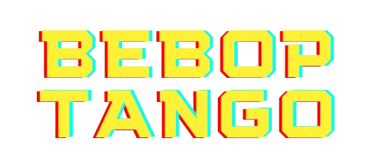

# BEBOP TANGO 

## [Play the Game!](https://emxgrz.github.io/bebop-tango-game/)

# Description

¿Alguna vez has querido revivir las escena final de tu serie favorita miles de veces? ¿Incluso poder llegar a cambiarla? Si la respuesta es afirmativa, este es tu juego. Pásalo en grande mientras revives una escena icónica de uno de los animes más famosos de los noventa, ¡todo mientras disfrutas jugando con tus amigos!

# Main Functionalities

- El player 1 se mueve con la tecla "a" a la izquierda, "d" a la derecha, salta con "w" y dispara con "s".
- El player 2 se mueve con la tecla "j" a la izquierda, "l" a la derecha, salta con "i" y dispara con "k".
- Los jugadores pueden esquivar las balas saltando.
- Si a algún jugador le alcanza una bala, se acaba el juego.
- Si algún jugador se sale de la plataforma, se acaba el juego.
- Botón de restart para volver a comenzar la partida.
- Los botones suenan al ser pulsaods.
- Las balas suenan al ser disparadas.
- Al disparar, la imagen de los personajes cambia.
- Al morir, la imagen de los personajes cambia.
- Barras de vida que disminuyen si una bala colisiona con un jugador. 

# Backlog Functionalities

- Añadir niveles de dificultad.
- Plataforma en movimiento.
- Diferentes escenarios.
- Diferentes personajes.  

# Technologies Used

- HTML
- CSS
- JavaScript
- DOM Manipulation
- JS Classes
- JS Audio(), JS Image()

# States

- Pantalla de inicio
- Pantalla de juego
- Pantalla Game Over

# Extra Links 

### Slides
[Link](https://docs.google.com/presentation/d/1T0lxAGpptjuBp-HoxsII4klOqDn1YoLrPy_NDpr1ex8/edit?usp=sharing)

## Deploy
[Link](https://emxgrz.github.io/bebop-tango-game/)

## Excalidraw
[Link](https://excalidraw.com/#json=HGQShkYI8JgNai9PPoQuJ,RE2AIsLEzdNIGCFG282G1g)
